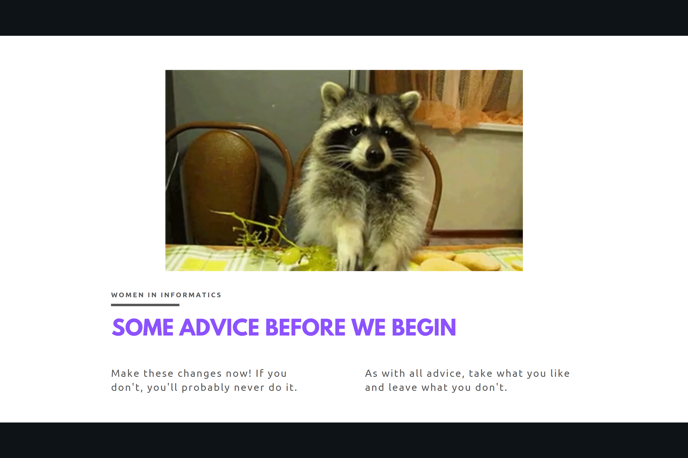
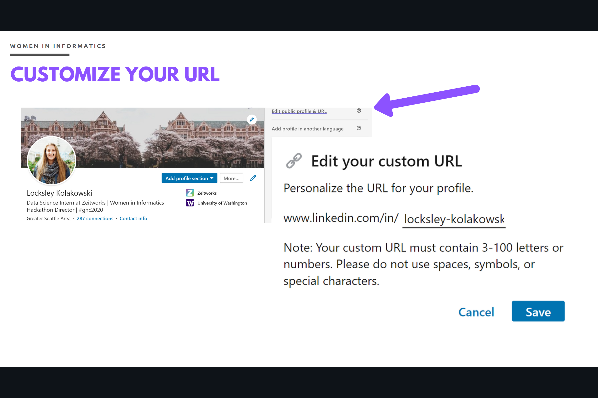
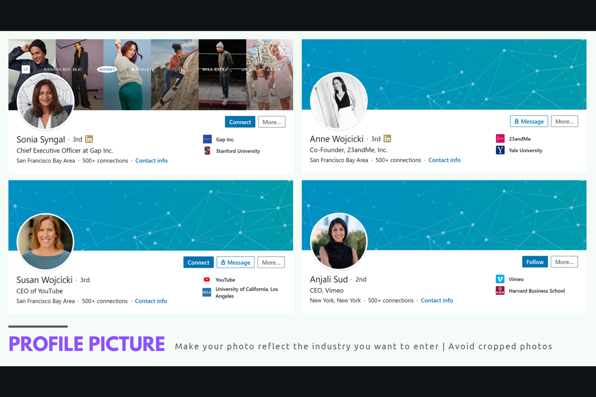
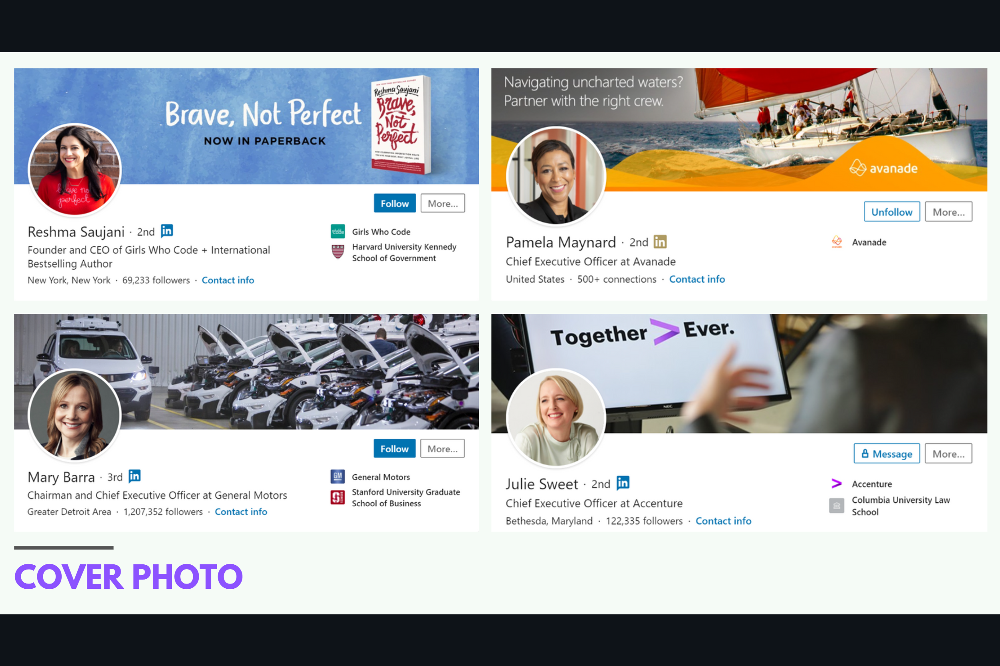
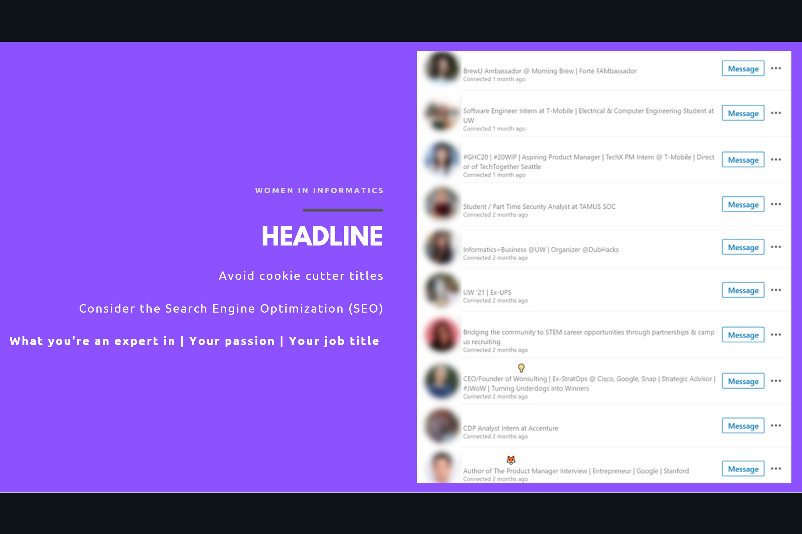
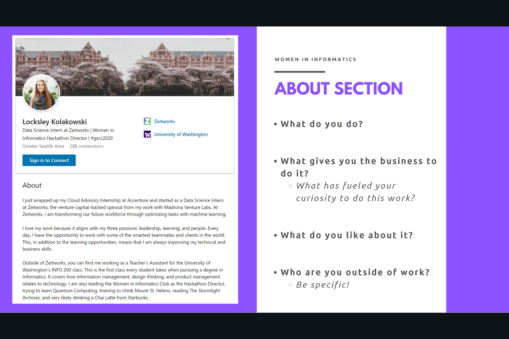

# LinkedIn Personal Branding Workshop

## What is a personal brand?
“A personal brand is what people say about you when you leave the room.”
It is what sets you out in the crowd.
It’s how people remember you.

## Some advice before we begin
First, have your LinkedIn Profile open and be making these changes now. If you don’t do it right now, you probably never will.

Second, one of the best pieces of advice I’ve ever personally received is I don’t need to follow everyone’s advice--because you’re going to get a lot of it. Take the ideas that you like and if something doesn’t feel right, don’t feel any pressure to add it.

For realsies now, let’s get to the actual content.

## Customize your URL
First things first: customize your LinkedIn URL!

Go to your profile and click the tab in the top right corner that says: Edit public profile & URL.

At this point, you can customize this. This is really important because LinkedIn automatically gives you a really long and messy URL which is hard to fit on resumes and makes it really hard to find you.

## Profile Picture
Next, let’s look at Profile pictures.

All of these women follow the guidelines really well. Their photo reflects the industry they are in. The techy companies are a little more casual and the other companies are a but more professional.

This is something to keep in mind: if your dream job is to be a software engineer at a tech company, you can probably get away with a less professional photo. However, if you want to go into consulting or a more professional field, you’ll want to put some more effort in getting a really crisp, professional photo of yourself.

Next, avoid cropped photos. Occasionally, you’ll see a photo on LinkedIn where it was pretty clear it was a group that they just cropped. And you can see other peoples arms and shoulders in the photo.

If this is all you have, it’s better than nothing, but definitely look into refreshing that as soon as possible.

## Cover photos
Let’s look at Reshma Saujani, the CEO and FOunder of Girls Who Code. She’s using her cover to advertise her book. And you probably can’t see it, but the shirt she is wearing also has Brave, Not Perfect written on it! And, she also has a TED Talk about the idea of women being Brave, not Perfect.

This is one of the best examples of personal brand because she has spent years curating it, and it has definitely paid off.

Next, let’s look at Pamela Maynard, the CEO of Avanda
Avanade is pretty unique because their brand color is orange.
Apparently, they use this same orange wave on all of their internal powerpoints!

Next up is Mary Barra, the CEO of General Motors. In her cover photo, it looks like those are either electric or self-driving cars. She’s using her cover photo to represent GM as a future-forward company.

Finally, we have Julie Sweet, the CEO of Accenture. Fun fact: she has just been named the Most Influential Businesswomen of 2020. I love how her background acknowledges the current world and even through the quarantine and stay at home earliers, they’re staying together.

You can easily turn your background into either:z
- A photo of your college campus
- A photo of the city you live in
- An action photo of yourself at a conference or giving a presentation

If you have some extra time, try using a tool like Canva which provides banners that you can customize

## Name
You want your name to be how you introduce yourself as. For example, if Pamela Maynard actually goes by Pam, she should use that.

Wy? It let’s your network and recruiters know how to refer to you from the very beginning.

Second, LinkedIn has been rolling out a new tool that helps with pronouncing your name. If you want to activate this, make sure that the pronunciation is accurate before it goes live on your profile.

## Headline
Your headline is really important. The biggest thing you want to avoid is cookie cutter titles such as Student at the University of Washington.

There are three reasons for this:
1. There are 40,000 other students at the University of Washington. You want to use LinkedIn to differentiate yourself, not blend in.
2. You want your title to be future-focused. You want to use the headline to show an employer where you are going, not where you are right now. If you brand yourself as a student, that is all an employer will see you as, rather than a viable candidate for a job.
3. You want to consider the Search Engine Optimization and use key words in your profile. Recruiters search for candidates by filtering for skills. If you don’t have your skills listed, the recruiters won’t even be able to find you.

## Final considerations
Here are some final considerations:
- Make sure your school and work is accurate. Go into settings and opt in to making this visible.
- Make sure your location is a place recruiters know. You want your location to be somewhere someone from outside of our state would know, such as the Greater Seattle Area.

## Slide 12
The About Section is one of the most important sections of your LinkedIn. This is your expanded elevator pitch to your network and recruiters. This is also where you need to include keywords of the skills and positions you’re looking to do in an internship or job. There are a lot of ways to do this, this is one: 

1. What do you do right now?
2. What gives you the business to do it?
3. How are you qualified?
4. What do you like about it?
5. Who are you outside of work?

A few other ways you can break this up:
Discuss your past, your present, and where you’re looking to go
Tell your unique story.

## Ready to try out networking in Lesson 3? Click [here](https://github.com/lynzley/project-upskill-workshop/tree/main/Lesson%203).
