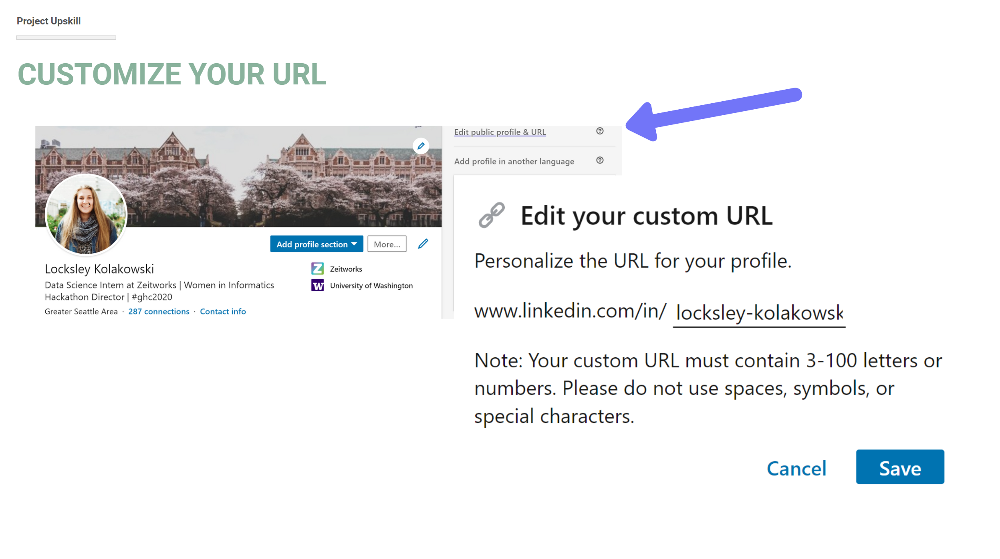
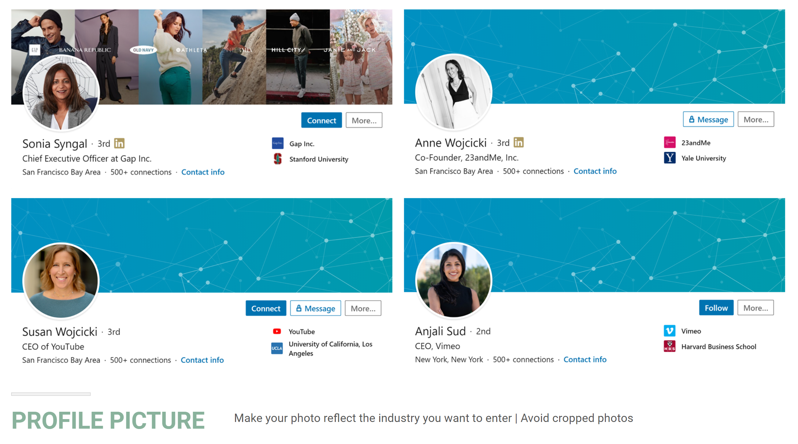
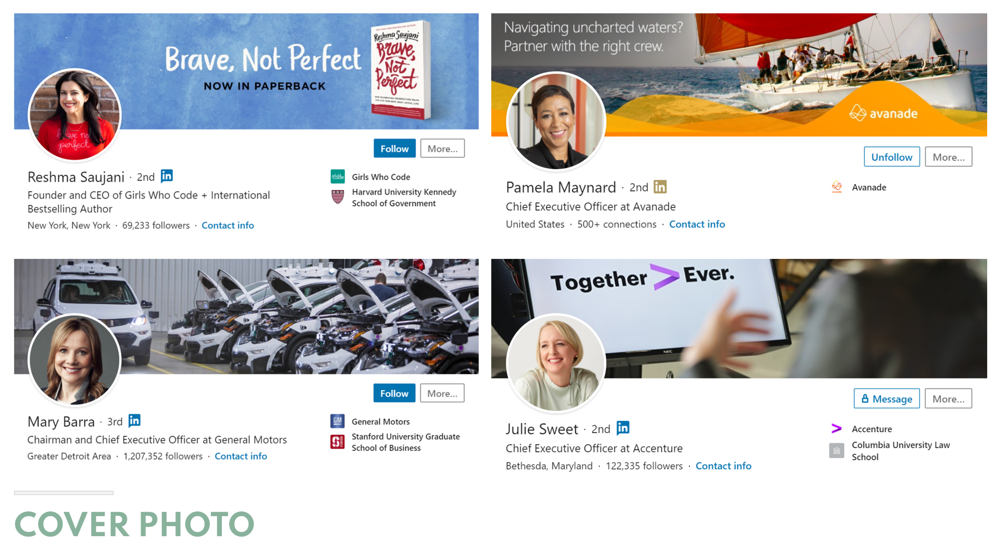
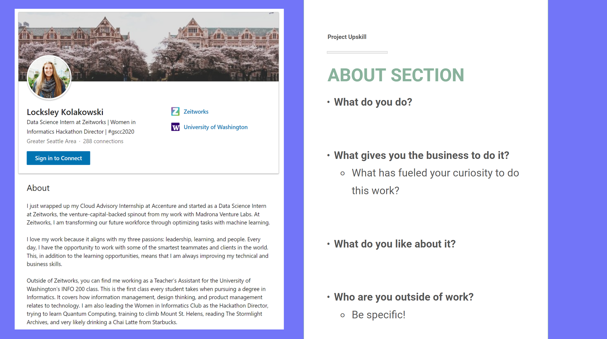

# LinkedIn Personal Branding Workshop

## What is a personal brand?
“A personal brand is what people say about you when you leave the room.”

- It is what sets you out in the crowd. 
- It’s how people remember you.

## Some advice before we begin
1. Have your LinkedIn Profile open and be making these changes now.
2. Don't feel pressured to use all of this advice; do what feels best for you.

## Customize your URL
1. Go to your profile and click the tab in the top right corner that says: Edit public profile & URL.
2. Customize the URL to your personal preference. This will help it be easier to find and fit better on a resume.

## Profile Picture
Choose a profile picture that:
- Reflects the industry you wish to enter (more professional for business/consulting, less professional for tech)
- Is not cropped from a group photo. Try to find a good headshot of just yourself!

## Cover photos
You want to customize your cover photo to represent your personal brand. A couple background ideas include:
- A photo of your college campus
- A photo of the city you live or work in
- An action photo of yourself at a conference or giving a presentation

**Tip**: If you have extra time, try using a tool like Canva which provides banners that you can easily customize.

## Name
You want your name to be how you introduce yourself as. For example, if you go by a nickname, she should use that. This let’s your network and recruiters know how to refer to you from the very beginning.

Second, LinkedIn has been rolling out a new tool that helps with pronouncing your name. If you want to activate this, make sure that the pronunciation is accurate before it goes live on your profile.

## Headline
Your headline is really important. The biggest thing you want to avoid is cookie cutter titles such as Student at the University of Washington.

There are three reasons for this:
1. There are 40,000 other students at the University of Washington. You want to use LinkedIn to differentiate yourself, not blend in.
2. You want your title to be future-focused. You want to use the headline to show an employer where you are going, not where you are right now. If you brand yourself as a student, that is all an employer will see you as, rather than a viable candidate for a job.
3. You want to consider the Search Engine Optimization and use key words in your profile. Recruiters search for candidates by filtering for skills. If you don’t have your skills listed, the recruiters won’t even be able to find you.

## Final considerations for the header
Here are some final considerations:
- Make sure your school and work is accurate. Go into settings and opt in to making this visible.
- Make sure your location is a place recruiters know. You want your location to be somewhere someone from outside of our state would know, such as the Greater Seattle Area.

## The About section
The About Section is one of the most important sections of your LinkedIn. This is your expanded elevator pitch to your network and recruiters. This is also where you need to include keywords of the skills and positions you’re looking to do in an internship or job. There are a lot of ways to do this, this is one: 

1. What do you do right now?
2. What gives you the business to do it?
4. What do you like about it?
5. Who are you outside of work?

A few other ways you can break this up:
- Discuss your past, your present, and where you’re looking to go
- Tell your unique story.

## Reflection
Congratulations, on levelling-up your LinkedIn Profile! Take a couple minutes to reflect on these points:
- What are the strong points in my LinkedIn Profile? How can I make these stand out?
- What are the weaknesses in my LinkedIn Profile? How could I improve them?

## Ready to try out networking? Click [here](https://github.com/lynzley/project-upskill-workshop/tree/main/Lesson%203).
