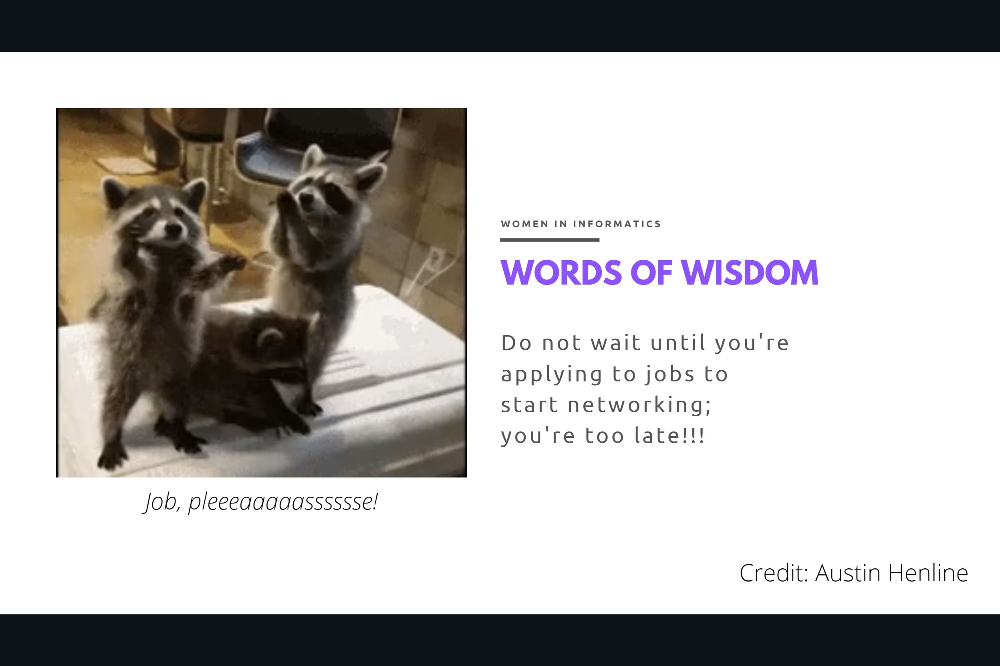
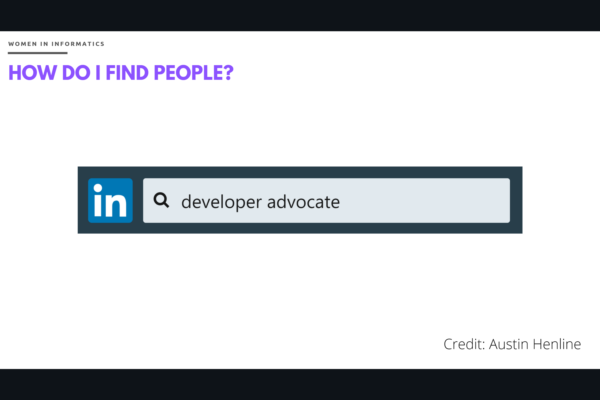
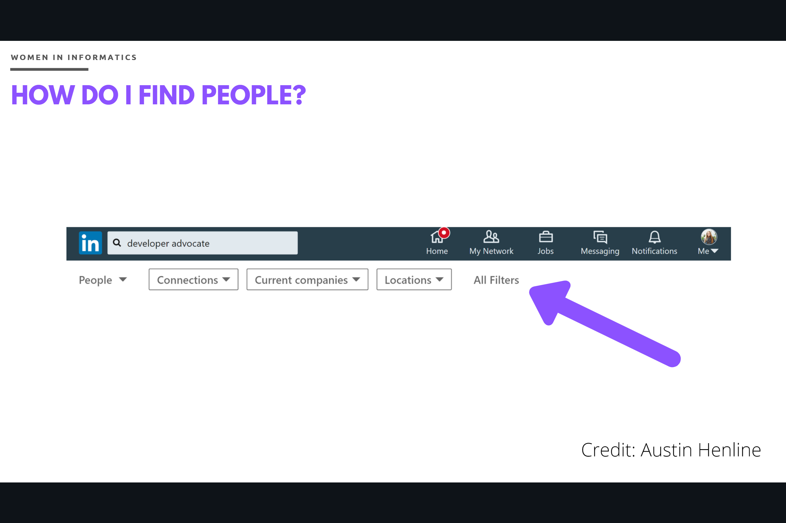
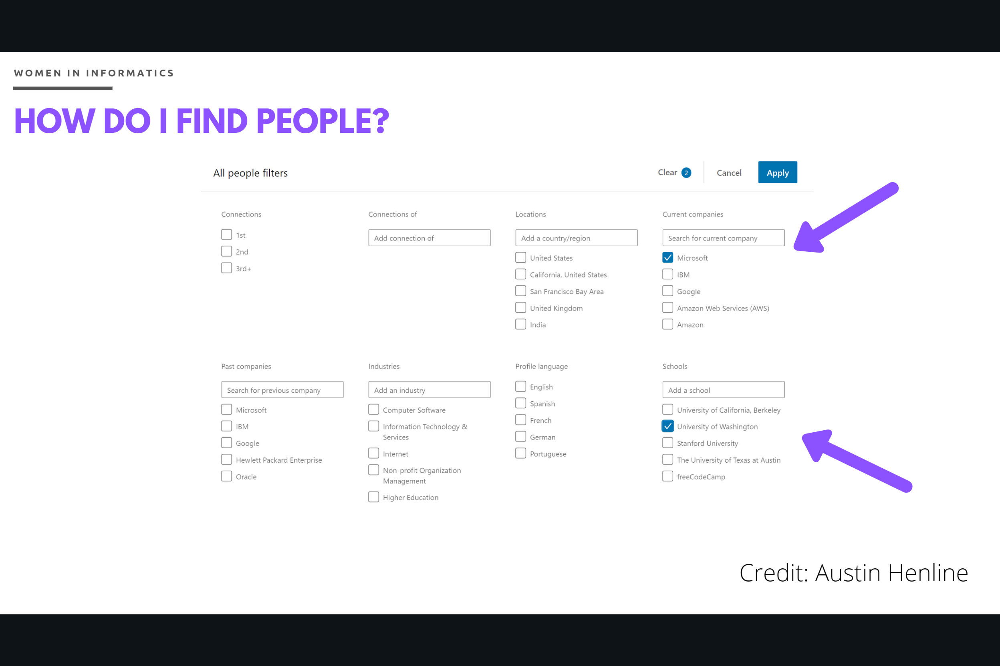
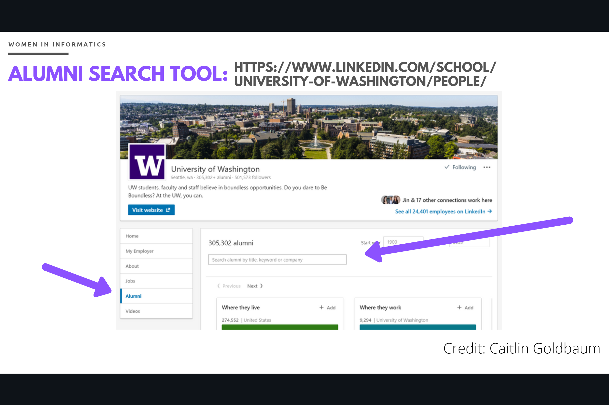
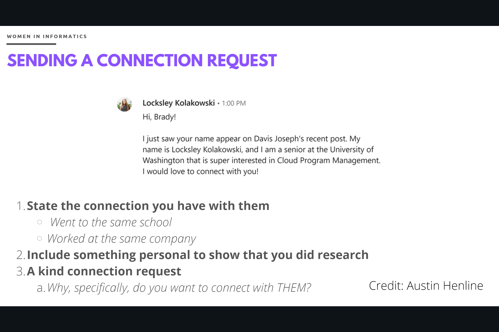
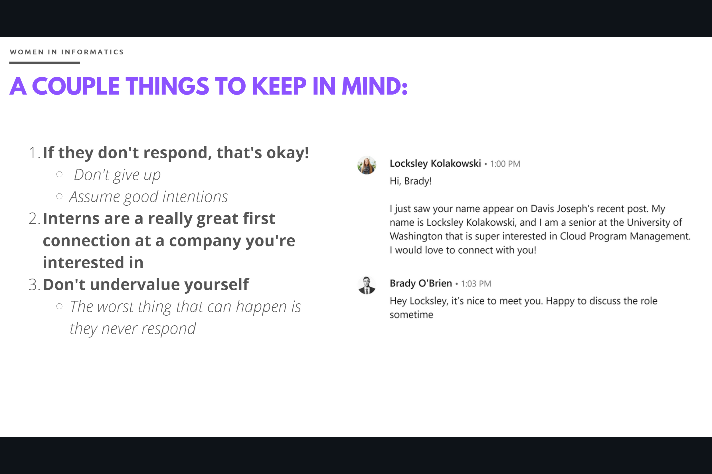
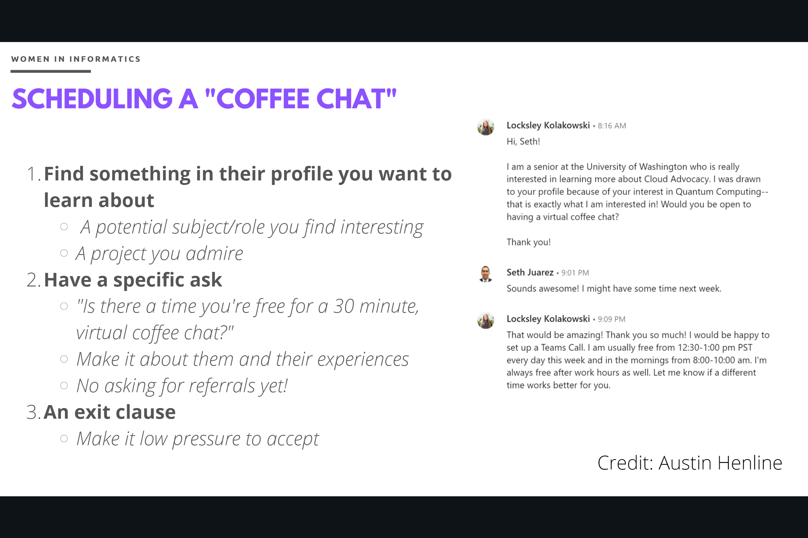

# LinkedIn Networking Workshop

## Words of Wisdom
- Do not wait until you're applying to jobs to start networking!
- You want to develop these connections now so you feel comfortable asking them for a referral a couple months down the road.

## How do I find people? pt. 2

1. Find the LinkedIn search bar at the top of the page
2. Type in the role you are interested in and select All Filters

3. From here, you can filter for company, school, and more! Choose your filters and click Apply.

## Alumni Search Tool

Another resource you can use is the Alumni Search Tool to specifically find people from the University of Washinton!
1. Navigate to: https://www.linkedin.com/school/university-of-washington/people/.
2. In the left column, select Alumni.
3. In the search box, type either the job title or company you're interested in.

## Sending a connection request

1. State the connection you have with them.
2. Include something personal to show that you did research.
3. Make it kind (why, specifically, do you want to connect with them?)

## A couple things to keep in mind:
1. If they don't respond, that's okay!.
2. Interns are a really great first connection at a company you're interested in.
3. Don't undervalue yourself.

## Scheduling a "coffee chat"

1. Find something in their profile you want to learn about
2. Have a specific ask
3. An exit clause

