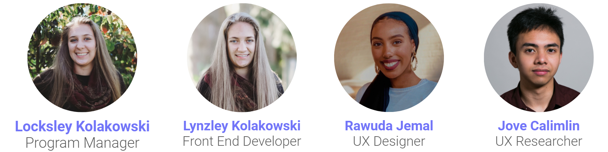

# Project Upskill
## *Upskill your soft skills*

## Project Overview
A **soft skill** gap is growing between college grads and future employers, disproportionality affecting **first-generation** college students. We aim to close this gap by creating **3 workshops** targetting key areas in supporting the growth of student's soft skills. Each workshop can be included individually or through a cohort and includes pre- and post-lesson exercises, written instructions to complete the lesson, a slide deck, and more. 

## Key features
Project Upskill is a repository that provides workshop materials to organizations that empower college students to develop their soft skills. Each workshop contains a full customizable slide deck and written content to make upskilling much more easy and accessible to the students who may otherwise not have access to this knowledge.

We are only in phase 1 of developing this prpject, which means that there are more workshops and learning opportunities to come!

### Workshops

| Name      | Description |
| ----------- | ----------- |
| [Personal Brand](https://lynzley.github.io/project-upskill-workshop/Lesson%202/LinkedIn)      | Develop your personal brand on one of the most important professional platforms: LinkedIn!       |
| [Networking](https://lynzley.github.io/project-upskill-workshop/Lesson%203)    | Use LinkedIn to connect with iSchool alumni and grow your networking skills.       |
| [Behavioral Interview](https://lynzley.github.io/project-upskill-workshop/Lesson%203)    | Perfect your behavioral interview skills!       |

## Presentation Video

## Team

## Project Status
This is a University of Washington Information School Capstone project for Winter/Spring 2021.

This project is open-source! Check out the following pages to learn more and contribute!
- [Github](https://github.com/lynzley/project-upskill-workshop)
- Documentation
