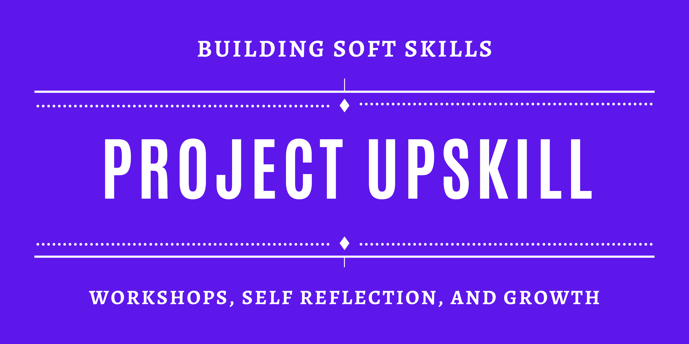

 

# Project Upskill Workshop

The UW iSchool's Capstone Team, Project Upskill, are pleased to offer a 12-week, 3-lesson curriculum all about developing professional skills. Each lesson includes pre- and post-lesson exercises, written instructions to complete the lesson, a slide deck, and more. Our workshop-based lessons allows you to learn while self-reflecting, a valuable way to grow as a professional.

Thank you to our authors Jove Calimlim, Rawuda Jemal, Locksley Kolakowski, and Lynzley Kolakowski!

## Lessons
| Name      | Description |
| ----------- | ----------- |
| [Personal Brand](https://github.com/lynzley/project-upskill-workshop/tree/main/Lesson%201)      | Learn more about your personality strengths and how this directly correlates to the most valued soft skills in the industry!       |
| [Networking?](https://github.com/lynzley/project-upskill-workshop/tree/main/Lesson%202)    | How can you optimize your personal brand to positively reflect in your resume, social media, and other aspects of your life?        |
| [Behavioral Interview](https://github.com/lynzley/project-upskill-workshop/blob/main/Lesson%203)    | How can you use what you learned to seek mentorship that will lead to professional growth and development?        |
