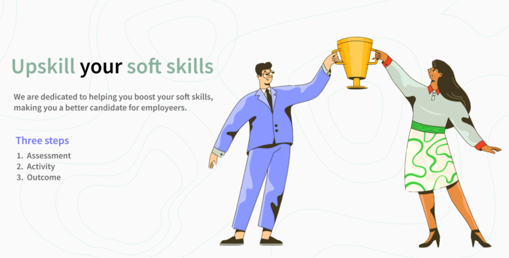

# Project Upskill
## *Upskill your soft skills*

## Project Overview
A **soft skill** gap is growing between college grads and future emplowers, disproportionality affecting **first-generation** college students. We aim to close this gap by creating **3 workshops** targetting three key areas in supporting the growth of student's soft skills. Each workshop can be included individually or through a cohort and includes pre- and post-lesson exercises, written instructions to complete the lesson, a slide deck, and more. 

## Key features
### Workshops

| Name      | Description |
| ----------- | ----------- |
| [Personal Brand](https://github.com/lynzley/project-upskill-workshop/tree/main/Lesson%202/LinkedIn)      | Develop your personal brand on one of the most important professional platforms: LinkedIn!       |
| [Networking](https://github.com/lynzley/project-upskill-workshop/tree/main/Lesson%203)    | Use LinkedIn to connect with iSchool alumni and grow your networking skills.       |
| [Behavioral Interview](https://github.com/lynzley/project-upskill-workshop/blob/main/Lesson%203)    | Perfect your behavioral interview skills!       |

## Presentation Video

## Team

## Project Status
